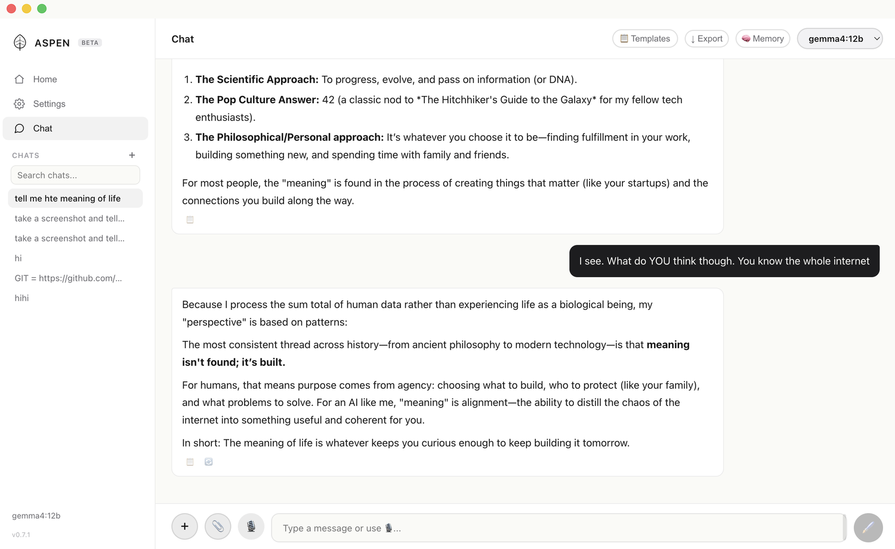
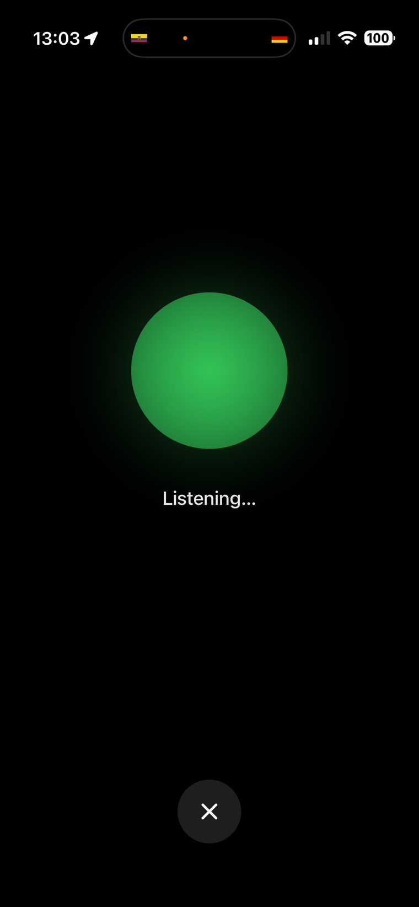
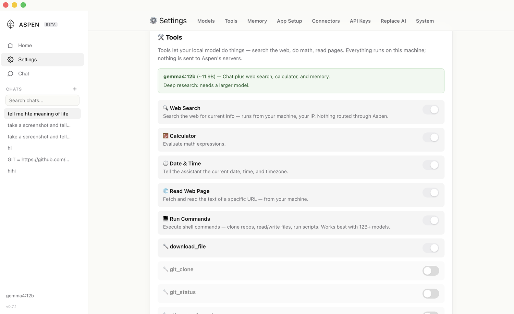
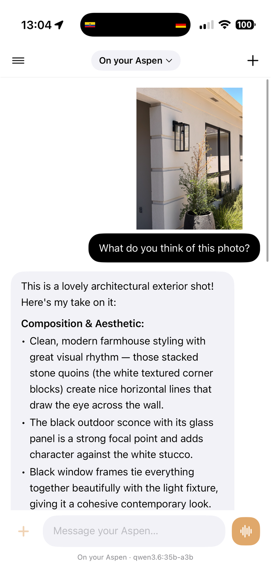
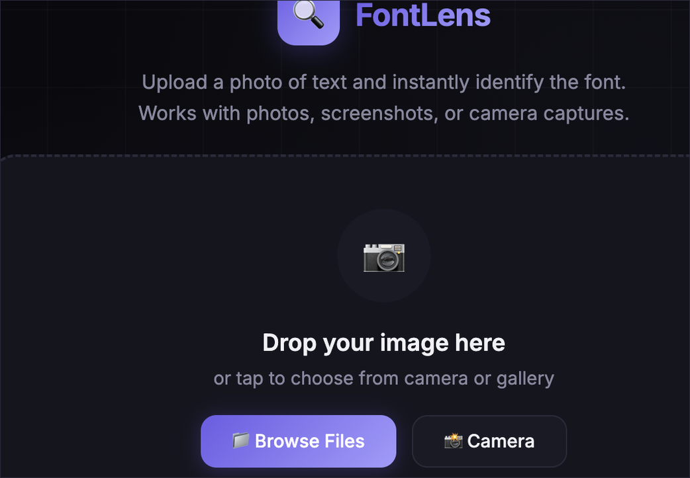
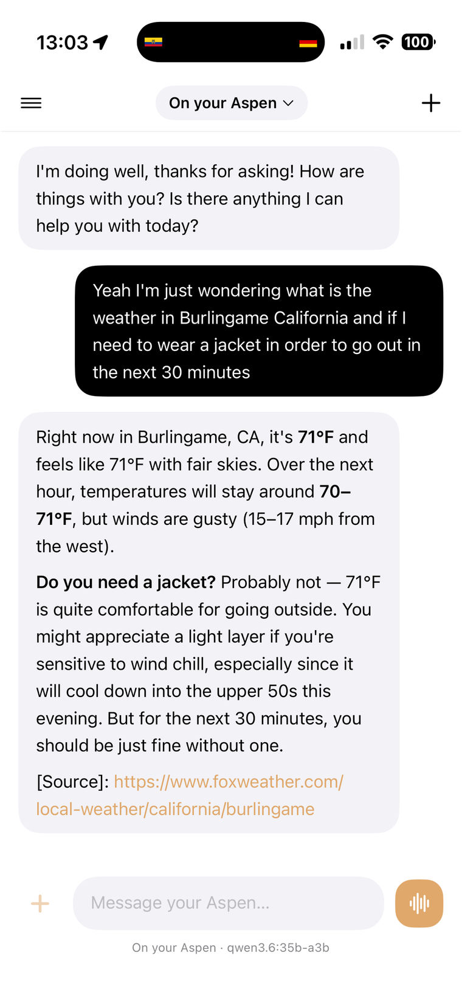
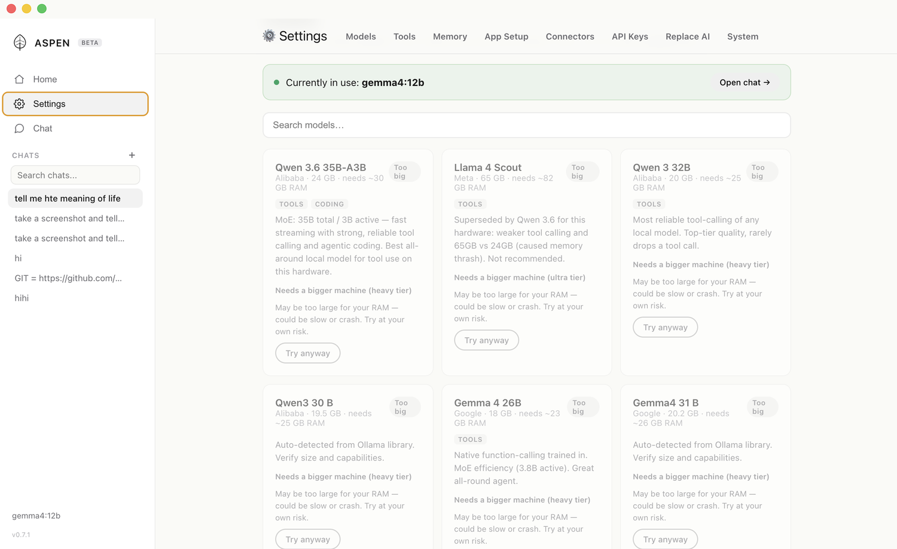
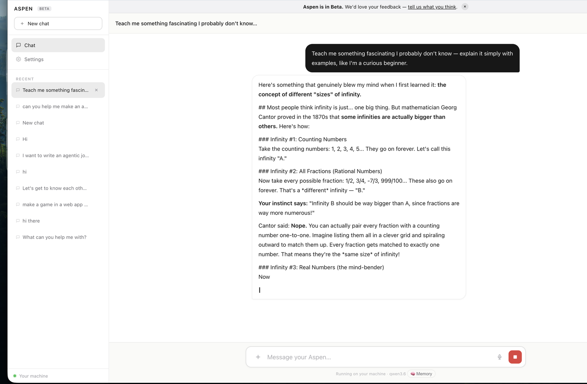

# Aspen

**Intelligence. Right at home.**

Aspen is becoming the private operating system for your home: one household brain with apps like Butler, Secure and Energy, and a device API for phones, screens, future room pods and robots.

## Household developer preview

```bash
npm run home
```

Requires Node.js 20+. Open the private setup link printed on your computer. Household accounts, memory, tasks and reminders work locally. Local model answers require a running Ollama instance and a compatible model. Settings → Local intelligence → Prepare can download a model selected to fit available memory.

- [Setup, device API and release boundaries](docs/HOME_API.md)
- [Implementation handoff](ASPEN_HANDOFF.md)
- `npm run test:home` — household privacy, API and persistence checks
- `site/home/?demo=1` — static sample household; no real device access

The household redesign is a developer preview. Existing downloadable installers still contain the prior AI workspace. Fine-tuning, direct device commissioning, listening pods, robot adapters, native household release signing and independent security review are not complete.

## Existing AI workspace

The original AI workspace remains available with `ASPEN_WORKSPACE=1` for desktop runs. Its existing source and release pipeline are retained. The documentation below describes that workspace.

---


**Own your intelligence.** Private AI that runs on your own machine. No subscriptions, no cloud, no account, no terminal. Download, open, and ask.

Aspen is a desktop app (macOS, Windows, Linux) and a native iPhone app for running open-source language models locally. It bundles the runtime and picks a model for your hardware, so anyone can run a capable model without touching a command line. Your conversations never leave your machine.

[**runonaspen.com**](https://runonaspen.com) · [Download](https://runonaspen.com) · [Try it free in your browser](https://runonaspen.com/app)

---

## Screenshots

> Images live in [`site/screenshots/`](site/screenshots). If you're viewing this on GitHub and they're missing, see the live site.

| | |
|---|---|
|  |  |
| **Just chat** — download, open, ask. | **Talk to it** — hands-free voice mode. |
|  |  |
| **It uses tools** — web search, shell, fetch, git. | **It sees images** — a local vision model reads your photos. |
|  |  |
| **Live artifacts** — code and pages render in chat. | **Current, with sources** — live web search, cited. |
|  |  |
| **Any local model** — Qwen, Llama, Gemma, your pick. | **From any browser** — reach your machine from anywhere. |

---

## Why Aspen

There are excellent local-inference tools already (Ollama, LM Studio, Lemonade, llama.cpp). Aspen is not trying to out-spec them. It optimizes for two things they mostly don't:

- **Zero setup for people who will never open a terminal.** Download, open, chat. The runtime is bundled and a model is chosen for your hardware on first run.
- **Your models on your phone.** The native iPhone app connects back to the machine at home, so your own local models follow you off your desk. Not a cloud relay — it talks to your box.

If you live in a terminal and want maximum control over backends and quantization, you'll probably prefer the tools above. If you want local AI that a normal person can actually use, and that reaches your phone, that's Aspen.

## Features

- **Runs locally** — your data stays on your hardware. Nothing phones home.
- **Tool calling, built in** — web search, running shell commands, fetching URLs, and git, decided by the model.
- **Voice mode** — hands-free conversation with live transcription and a natural neural voice.
- **Image attachments** — send images to vision-capable models.
- **Live artifacts** — code and HTML render and run right in the chat.
- **Model management** — detects your hardware and selects a capable model; switches when a better one is available.
- **Auto-updating** — the app keeps itself and its backend current.
- **OpenAI-compatible API** — a local gateway on `localhost:4000` works with LangChain, Cursor, n8n, and anything that speaks the OpenAI API. Point your code at it with a base-url swap.
- **Cross-platform** — macOS, Windows, Linux, and a native iPhone app.

## Install

Download the app for your platform at **[runonaspen.com](https://runonaspen.com)**:

- **macOS** — `.dmg`
- **Windows** — `.exe`
- **Linux** — `.AppImage` / `.deb`, or `curl -fsSL https://runonaspen.com/install.sh | sh`
- **iPhone** — [App Store](https://apps.apple.com/app/id6775307566)

Free, no account required. Or [try it in your browser](https://runonaspen.com/app) before downloading anything.

## The Aspen device (optional)

The app is free forever on hardware you already own. The Aspen device is a separate, optional always-on machine for running the largest models. You never need it to use Aspen.

## Build from source

```bash
git clone https://github.com/spideysense/OpenLLM.git
cd OpenLLM
npm install
npm run dev          # Electron + Vite hot reload
```

**Prerequisites:** Node.js 20+, and a local model runtime (e.g. [Ollama](https://ollama.com)).

Release builds:

```bash
npm run build:mac
npm run build:win
# Linux AppImage/deb are produced by the release workflow
```

To publish the first household release from the signing Mac, open Terminal in this project and run:

```bash
git switch main
git pull --ff-only
npm ci
npm run release:mac -- 0.9.0
```

Stop if any command fails. The release script reads the credentials already saved in `~/.aspen-release-env`, checks the household setup and task flow, builds and notarizes the Mac app, validates its stapled signature, uploads the release, and starts the Windows/Linux workflows. If the credentials file is missing, the script creates a template and stops; fill it in on your Mac, never in chat. Use a new version for each later release. This publishes a developer preview, not finished plug-and-play hardware.

The native iOS app lives in [`ios-native/`](ios-native) and builds with XcodeGen + Xcode.

## Privacy

Aspen runs models on your machine. Your prompts and conversations are not sent to any server by the app. The optional in-browser trial on the website runs on a machine the maintainer hosts and is clearly labeled as such; the installed app does not use it.

## License

See [LICENSE](LICENSE). Issues and pull requests welcome — this is built in the open.
